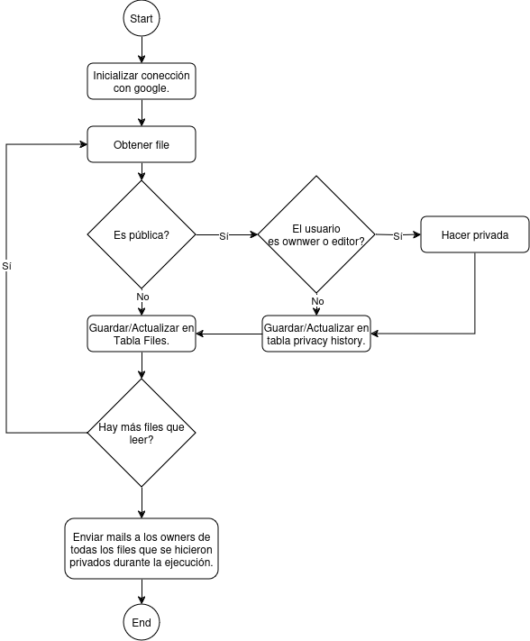

# GDrive-DB
GDrive-DB es un aplicación para inventariar en una Base de Datos todos los archivos pertenecientes a la unidad de Drive de un usuario, y asegurar su privacidad. \
Al utilizar la aplicación, el usuario obtendrá una base de datos con la información de los archivos en su drive y cuándo fue la ultima vez que se detectó visibilidad pública para los mismos. Además, la aplicación privatizará cualquier archivo público al que el usuario tenga permisos suficientes para hacerlo y le enviará un mail al owner.

## Diagrama de flujo


# Usage
Para utilizar la aplicación es necesario contar con una versión de docker que cuente con docker compose v2.
### Para iniciar la app:
```bash
$ make run
```

Con la aplicación inicializada, acceder mediante http://127.0.0.1:5000/ e iniciar sesión con google.

En caso de querer cambiar de cuenta, acceder  http://127.0.0.1:5000/logout

### Para acceder a la base de datos:
Mientras la app esté en ejecución
```bash
$ make sql
```

### Para correr los tests:
La variable de entorno `RUN_TESTS` debe estar seteada en 1. La variable se encuentra en el archivo `.env`. En caso de no querer corre los tests, setearla en 0.

# Base de datos
La aplicación utiliza una base de datos PostgreSQL para almacenar la información de los archivos de Google Drive. \
La base de datos cuenta con una tabla `files` con las siguientes columnas:
- `id`: Identificador único del archivo.
- `name`: Nombre del archivo.
- `extension`: Extensión del archivo.
- `owner`: Dueño del archivo.
- `visibility`: Visibilidad del archivo.
- `last_modified`: Fecha de la última modificación del archivo.

La tabla `privacy_history` cuenta con las siguientes columnas:
- `id`: Identificador único del archivo.
- `last_public`: Fecha de la última vez que el archivo fue público.


# Estructura del código:
La aplicación cuenta con 4 archivos de código, y 6 archivos para su ejecución.

El flujo principal de la aplicación se encuentra en `app.py`. En este archivo se definen las rutas de la aplicación y se manejan las peticiones de los usuarios. \
`google_lib.py` contiene las funciones necesarias para interactuar con la API de Google Drive. \
`gdrive_db.py` contiene la lógica de la aplicación, y se encarga de la interacción con la base de datos. \
`tests.py` contiene los tests de la aplicación.

`Dockerfile` y `docker-compose.yml` son los archivos necesarios para la ejecución de la aplicación en un contenedor de docker. \
`Makefile` contiene los comandos necesarios para la ejecución de la aplicación. \
`requirements.txt` contiene las dependencias necesarias para la ejecución de la aplicación. \
`credentials.json` contiene las credenciales necesarias para la autenticación de la aplicación con la API de Google. \
`.env` contiene las variables de entorno necesarias para la ejecución de la aplicación.

# Siguientes pasos:
Como futuras mejoras, se debería implementar más tests para la aplicación, y mejorar la cobertura de los mismos. Se podría mejorar la interfaz gráfica de la aplicación.
